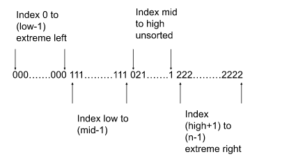

# Dutch National Flag Algorithm - Explanation & Intuition

## 🔍 Problem Statement

Given an array containing only 3 types of elements (e.g., 0, 1, 2), sort the array in-place **without using any sorting algorithm**, such that all 0s come first, followed by 1s, then 2s.

> Example:
> Input:  [2, 0, 2, 1, 1, 0]  
> Output: [0, 0, 1, 1, 2, 2]

---

## 🧠 Intuition

This algorithm is called the **Dutch National Flag Algorithm**, proposed by **Edsger Dijkstra**, inspired by the Dutch flag which has three colors.

The key idea is to **partition** the array into **three sections**:
- **Low (start of array)** → All 0s
- **Mid (middle section)** → All 1s
- **High (end of array)** → All 2s

We use three pointers:
- `low` → boundary between 0s and 1s
- `mid` → current element being evaluated
- `high` → boundary between 1s and 2s
- arr[0….low-1] contains 0. [Extreme left part] 
- arr[low….mid-1] contains 1. [Middle part]
- arr[high+1….n-1] contains 2. [Extreme right part], n = size of the array
The middle part i.e. arr[mid….high] is the unsorted segment. So, hypothetically the array with different markers will look like the following:

  

In our case, we can assume that the entire given array is unsorted and so we will place the pointers accordingly
---

## 🔄 How It Works

```java
public void sortColors(int[] nums) {
    int low = 0, mid = 0, high = nums.length - 1;

    while (mid <= high) {
        if (nums[mid] == 0) {
            swap(nums, low, mid);
            low++;
            mid++;
        } else if (nums[mid] == 1) {
            mid++;
        } else { // nums[mid] == 2
            swap(nums, mid, high);
            high--;
        }
    }
}

private void swap(int[] nums, int i, int j) {
    int temp = nums[i];
    nums[i] = nums[j];
    nums[j] = temp;
}
```

---

## 🧠 Why It Works

- **All 0s are pushed to the front** by swapping with `low` and moving `low` and `mid` forward.
- **All 2s are pushed to the back** by swapping with `high` and **only decrementing `high`**.
- **All 1s remain in the middle**, just move `mid` forward.

---

## ✅ Time and Space Complexity

| Metric | Value     |
|--------|-----------|
| Time   | O(n)      |
| Space  | O(1)      |

This algorithm is **in-place**, single-pass, and optimal.

---

## 📌 Real-World Analogy

Imagine you are sorting a box of Dutch flags with **Red (0), White (1), and Blue (2)** sections.
- You pick one flag at a time (`mid`)
- If it's red, send it to the front (`low`)
- If it's blue, send it to the back (`high`)
- If it's white, leave it in the middle

---

## 🧪 Use Cases

- Sorting arrays of categorical data with 3 labels (e.g., low, medium, high)
- Preprocessing data for 3-way partition problems
- Memory-efficient sorting when elements are limited to a small set

---

Happy Coding! 🚀
